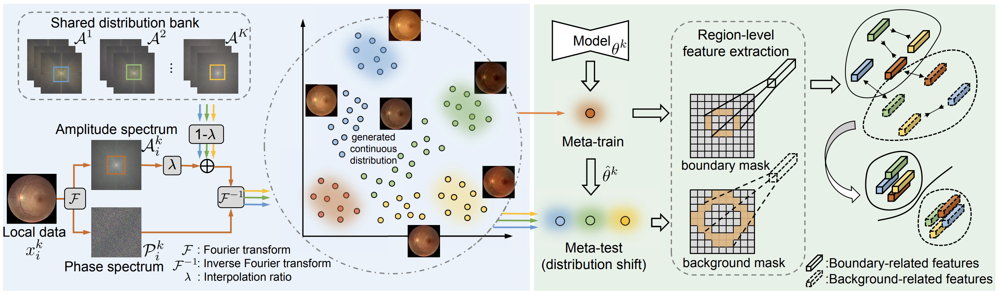
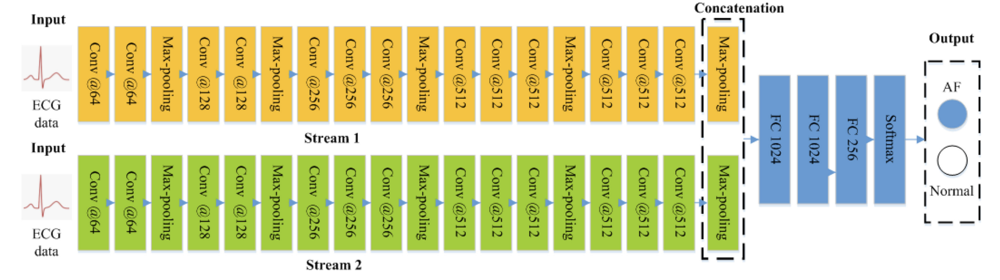
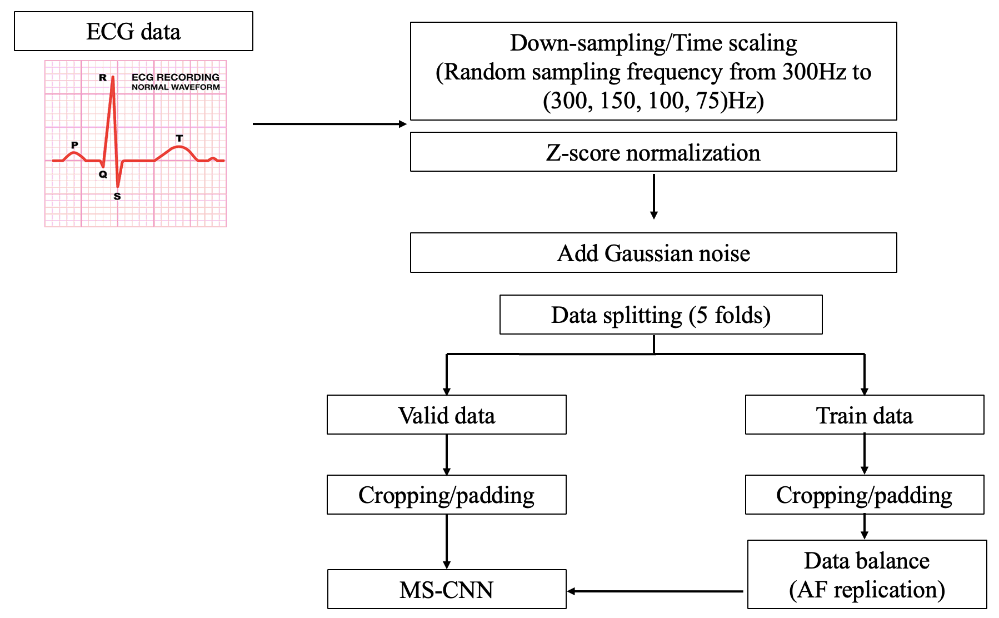

# Overview
This repository contains two distinct projects focusing on medical image segmentation and electrocardiogram (ECG) signal classification. Both projects aim to contribute to the fields of medical imaging and biomedical signal processing through innovative approaches and advanced methodologies. 

------
## Project 1: Domain-Adaptive Medical Image Segmentation
### Introduction
This project explores the use of U-Net and its variants for medical image segmentation across multiple domains. We address the challenge of domain shift in medical imaging by investigating the generalization capabilities of segmentation models trained on a single domain and tested across various unseen domains. And the figure below shows the pipeline of this project.

### Methodology
1. Model Training and Evaluation: We employed U-Net and its variants, including 2D U-Net and TransUNet, to train segmentation models on Domain 1. The models were evaluated on all available domains using metrics such as Dice Coefficient, 95% Hausdorff Distance (HD95), and Average Symmetric Surface Distance (ASSD).

2. t-SNE Visualization: To understand the feature distribution across domains, we used t-distributed stochastic neighbor embedding (t-SNE) for visualization in both image and feature spaces. This helped in assessing the domain discrepancies and model generalization.

3. Frequency Domain Analysis and Style Transfer:

* Fourier Transform: Following the FedDG methodology, we performed 2D Fourier transforms on training samples from Domains 1 to 5. We analyzed the amplitude and phase spectra, applied grayscale adjustments, and centralized the frequency spectra.

* Parameter Selection and Image Translation: We selected appropriate parameters to transfer the style of Domain 1 images to at least three other domains. The transferred images were evaluated for inter-domain class distances, and t-SNE was used again for visualization.

* Combined Segmentation and Style Transfer: We trained a segmentation model using the original Domain 1 images and the ethically transferred images and labels from Task 2. The model was tested following the same protocol as in Task 1 to assess improvements in segmentation performance across domains.

### Results and Contributions
Demonstrated the limitations of segmentation models when applied to unseen domains.
Showed that style transfer and frequency domain augmentation can reduce domain discrepancies.
Provided insights into the feature representations across domains through visualization techniques.

------
## Project 2: Enhanced ECG Signal Classification Using Advanced Feature Extraction
### Introduction
Building upon the work titled "Multiscaled Fusion of Deep Convolutional Neural Networks for Screening Atrial Fibrillation From Single Lead Short ECG Recordings", this project focuses on classifying normal and atrial fibrillation (AF) ECG signals. Our primary innovation lies in the feature engineering stage, where we integrated advanced heart rate variability (HRV) features to improve classification accuracy.

### Methodology

1. Feature Engineering:
Utilized the hrv-analysis third-party library to extract advanced HRV features.
Calculated time-domain, frequency-domain, and non-linear HRV metrics to capture the intricate patterns associated with AF.
2. Model Development:
Implemented a multi-scaled fusion of deep convolutional neural networks (CNNs) to handle the diverse feature set.
Combined raw signal inputs with engineered HRV features for a comprehensive analysis.

3. Data Preprocessing and Training Pipeline:

Designed a training pipeline that integrates feature extraction, model training, and validation.
Employed cross-validation techniques to ensure the robustness of the model.
### Results and Contributions
Achieved improved classification performance by incorporating advanced HRV features.
Demonstrated the effectiveness of feature engineering in enhancing deep learning models for biomedical signal classification.
Provided a scalable and generalizable pipeline for ECG signal analysis that can be extended to other cardiac abnormalities.
## Repository Structure
* `FedDG/`: Contains codes for first project.
* `AtrialFibrillationClassification/`: Contains codes for second project.
* `pics/`: Some images.
* `README.md`: Project overview and instructions.
* `Report/`
<!-- requirements.txt: List of required Python packages. -->

# References
1. Liu Q, Chen C, Qin J, et al. Feddg: Federated domain generalization on medical image segmentation via episodic learning in continuous frequency space[C]//Proceedings of the IEEE/CVF conference on computer vision and pattern recognition. 2021: 1013-1023.
2. Fan X, Yao Q, Cai Y, et al. Multiscaled fusion of deep convolutional neural networks for screening atrial fibrillation from single lead short ECG recordings[J]. IEEE journal of biomedical and health informatics, 2018, 22(6): 1744-1753.